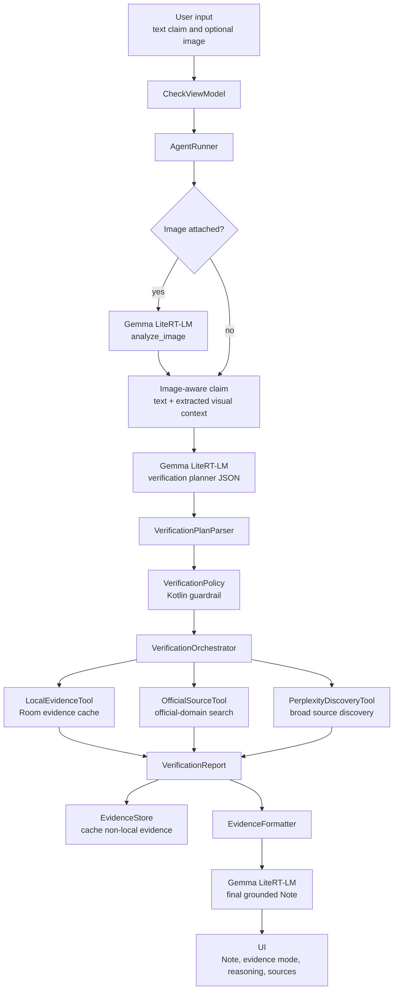
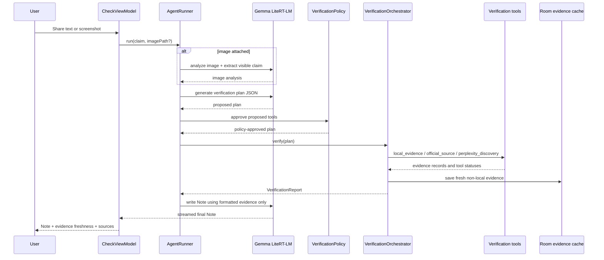

# Resibo

> **Resibo** (Filipino for "receipt") — an Android app that helps Filipino users check social media claims by combining local Gemma 4 understanding with evidence-gathering tools.

Hand it the **contents** of a post (screenshot or text) via the Android Share Target and it returns a **Note**: what evidence was checked, how fresh it is, what sources say, and what still needs verification. Gemma 4 runs locally for private claim and image understanding. Online tools may be used to gather current evidence, and verified evidence is cached locally so repeated claims become easier to check over time.

**The agent produces a Note, not a Verdict.** You decide.

## How to use it

Resibo reads what you hand it directly. For current claims, it may use online evidence tools when available; when evidence is missing or stale, it should say so instead of guessing. For best results, **share the content itself, not just a link**.

| You see a rumor on… | Share this to Resibo |
|---|---|
| Facebook / X post | A screenshot of the post (long-press → screenshot → Share → Resibo) |
| Messenger / Viber / WhatsApp message | Long-press the message → **Share** → Resibo |
| TikTok / Reels video | A screenshot of the claim, caption, or on-screen text |

Sharing just a **link** (e.g. `facebook.com/post/12345`) may get a limited reply: Resibo may not be able to access login-gated or social URLs directly, so share screenshot or text content for best results.

---

## Status

🚧 In active development for the [Gemma 4 Good Hackathon](https://kaggle.com) — deadline **May 18, 2026**.

This is the Android client. Companion repos:

- [`resibo-eval`](https://github.com/pi-pi-dev/resibo-eval) — evaluation harness and PH-Hard eval set
- [`resibo-train`](https://github.com/pi-pi-dev/resibo-train) — QLoRA fine-tuning pipeline for Gemma 4

## What it does

- Accepts shared post content from any Android app (text · image)
- Normalizes text and screenshot/image input for local claim and image analysis
- Runs a verification flow: claim decomposition → evidence tool planning → evidence gathering → reasoning → Note generation
- Uses one sideloaded **Gemma 4 LiteRT-LM bundle** at `gemma.litertlm` for image analysis, verification planning, and final Note generation
- Returns a structured Note with checked evidence, source freshness, confidence band, and explicit abstentions
- Caches verified evidence locally so repeated claims become easier to check over time

## Current model

The Android app currently loads a single on-device model bundle:

```text
/sdcard/Android/data/com.patslaurel.resibo/files/gemma.litertlm
```

`LlmTriageEngine` loads that `.litertlm` file through Google AI Edge LiteRT-LM and reuses the same engine for:

- screenshot/image understanding via multimodal input
- verification-plan JSON generation
- final evidence-grounded Note generation

The app does not currently route between separate 1B and 4B models. The model filename is intentionally stable so different compatible Gemma 4 LiteRT-LM bundles can be sideloaded without changing app code.

## Agent architecture





## Stack

- **Platform**: Android-only, native Kotlin + Jetpack Compose
- **Runtime**: Google AI Edge LiteRT-LM
- **Model**: one sideloaded Gemma 4 `.litertlm` bundle named `gemma.litertlm`
- **Languages supported**: Tagalog, English, Taglish, Cebuano, Bisaya
- **Evidence tools**: local evidence cache, official-source search, Perplexity discovery
- **On-device**: no sign-in, no telemetry, encrypted local storage

## Build

Requirements:

- Android Studio Ladybug or later
- JDK 17
- Android SDK 34+
- A physical device with enough RAM/storage for the sideloaded `gemma.litertlm` bundle

## Secrets

This repo is intended to be built locally, not distributed with shared API keys. Put secrets in the root `local.properties` file. That file is ignored by git.

```properties
# Usually created by Android Studio. Keep your existing sdk.dir line if present.
sdk.dir=/path/to/Android/sdk

# Required for live evidence search.
PERPLEXITY_API_KEY=your_perplexity_key
```

Notes:

- `PERPLEXITY_API_KEY` powers `perplexity_discovery` and official-domain evidence search.
- If the key is missing, the app can still run local Gemma inference and local evidence search, but online evidence tools will fail or return no evidence.
- This key is embedded into the locally built debug APK through `BuildConfig`. Do not publish APKs built with your personal key.

## Install on a phone

1. Clone the repo and open it in Android Studio, or build from the terminal:

```bash
git clone https://github.com/jplaulau14/resibo-android.git
cd resibo-android
```

2. Add the secrets above to `local.properties`.

3. Download a compatible Gemma 4 LiteRT-LM model bundle. The current recommended model is [`litert-community/gemma-4-E4B-it-litert-lm`](https://huggingface.co/litert-community/gemma-4-E4B-it-litert-lm), which provides Gemma 4 E4B in `.litertlm` format for LiteRT-LM. Rename the downloaded `.litertlm` file to `gemma.litertlm`, then sideload it to the app's external files directory:

```bash
adb devices
adb shell 'mkdir -p /sdcard/Android/data/com.patslaurel.resibo/files'
adb push /path/to/gemma.litertlm /sdcard/Android/data/com.patslaurel.resibo/files/gemma.litertlm
adb shell 'ls -lh /sdcard/Android/data/com.patslaurel.resibo/files/gemma.litertlm'
```

4. Build and install the debug app:

```bash
./gradlew assembleDebug
./gradlew installDebug
```

5. Launch Resibo on the phone. Share text or a screenshot into Resibo from another app, or open the app directly and use the Check tab.

Model download behavior:

- The app currently does not download the model automatically. It expects `gemma.litertlm` to already exist at `/sdcard/Android/data/com.patslaurel.resibo/files/gemma.litertlm`.
- A future setup screen can handle model download explicitly, with Wi-Fi/storage checks, progress, checksum validation, and a clear license/terms step.

Troubleshooting:

- If install fails with no device, enable Developer options and USB debugging, then re-run `adb devices`.
- If the app says the model is missing, verify the exact phone path and filename: `/sdcard/Android/data/com.patslaurel.resibo/files/gemma.litertlm`.
- If live evidence does not appear, confirm `PERPLEXITY_API_KEY` is in `local.properties`, then rebuild and reinstall with `./gradlew installDebug`.
- If the model fails to load, use a physical device with enough RAM and storage for the selected `.litertlm` bundle.

## Target prizes

Safety & Trust · Cactus · LiteRT · Unsloth · Grand Prize

## License

MIT — see [LICENSE](./LICENSE).
